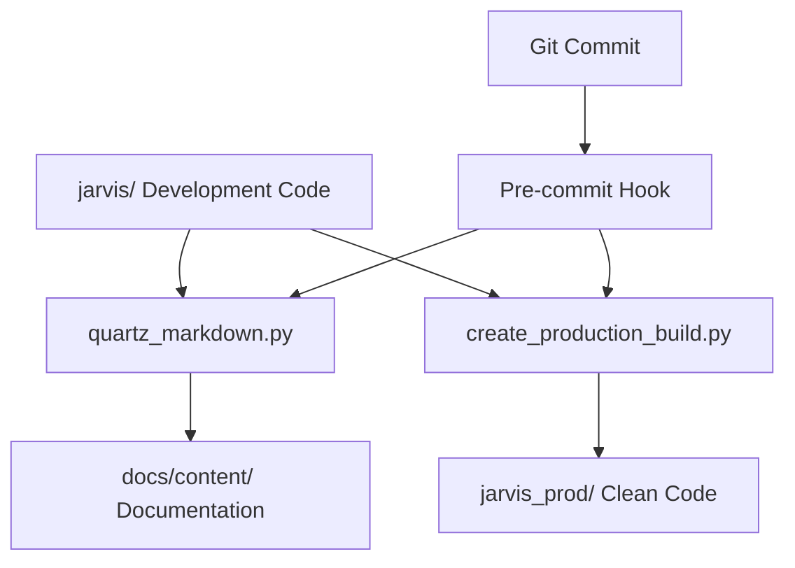

# 🎓 Master Guide: Comment Annotation Workflow System

*A Computer Science Professor's Guide to Professional Code Documentation and Production Deployment*

---

## 📚 Table of Contents

1. [Introduction: The Problem We Solved](#introduction-the-problem-we-solved)
2. [Understanding Comment Annotations](#understanding-comment-annotations)
3. [The Software Engineering Challenge](#the-software-engineering-challenge)
4. [Our Solution: Annotation-Based Workflow](#our-solution-annotation-based-workflow)
5. [Git Hooks: Automation in Version Control](#git-hooks-automation-in-version-control)
6. [Complete Workflow Walkthrough](#complete-workflow-walkthrough)
7. [Behind the Scenes: Technical Implementation](#behind-the-scenes-technical-implementation)
8. [Best Practices and Guidelines](#best-practices-and-guidelines)
9. [Troubleshooting Common Issues](#troubleshooting-common-issues)
10. [Advanced Topics](#advanced-topics)

---

## 🎯 Introduction: The Problem We Solved

### The Classic Developer Dilemma

Imagine you're building a complex software project like our Jarvis StreamDeck automation system. You face a fundamental conflict:

**As a Learning Developer:**
- You want to document your journey, design decisions, and computer science concepts
- You include extensive comments explaining *why* you chose certain patterns
- You write educational notes about algorithms, architecture, and trade-offs
- Your files become rich with knowledge but also quite large

**As a Professional Developer:**
- You need clean, production-ready code for deployment
- Other developers shouldn't wade through your learning notes to understand the code
- File sizes should be optimized for performance
- Comments should be concise and focused on essential information

### The Traditional (Problematic) Solutions

❌ **Separate Repositories:** Maintain two different codebases - leads to sync issues
❌ **Manual Cleanup:** Remove educational comments before deployment - error-prone and irreversible
❌ **All or Nothing:** Either keep all comments (messy production) or remove all (lose valuable documentation)

### Our Elegant Solution

✅ **Comment Annotation System:** Use special prefixes to categorize comments, then automatically generate both comprehensive documentation AND clean production code from a single source.

---

## 🏷️ Understanding Comment Annotations

### What Are Comment Annotations?

Comment annotations are special prefixes we add to comments to categorize their purpose. Think of them as "tags" that help our automated tools understand what to do with each comment.

### The Four Types of Annotations

#### 1. `# EDU:` - Educational Comments
**Purpose:** Computer science concepts, learning notes, algorithm explanations

**Example:**
```python
# EDU: This implements the Observer Pattern from Gang of Four design patterns
# EDU: Observer Pattern allows objects to be notified of state changes
# EDU: Benefits: Loose coupling, dynamic relationships, broadcast communication
class EventNotifier:
    def __init__(self):
        self.observers = []  # EDU: List maintains insertion order in Python 3.7+
```

**When to Use:**
- Explaining design patterns and their benefits/drawbacks
- Computer science theory behind implementation choices
- Algorithm complexity analysis (Big O notation)
- Historical context of why certain approaches were chosen

#### 2. `# ARCH:` - Architecture Comments
**Purpose:** High-level design decisions, system architecture, component relationships

**Example:**
```python
# ARCH: Using dependency injection instead of global state for testability
# ARCH: Each module receives its dependencies from the application layer
# ARCH: This follows the Dependency Inversion Principle from SOLID
def initialize_actions(config, logger, input_handler):
    # ARCH: Configuration flows: app -> init -> actions (unidirectional)
    pass
```

**When to Use:**
- Explaining why you chose one architecture over another
- Documenting component relationships and data flow
- Rationale for technology stack decisions
- System boundaries and integration points

#### 3. `# DEV:` - Development Comments
**Purpose:** Implementation details, technical explanations, development insights

**Example:**
```python
# DEV: Using hasattr() check because setattr() fails silently if attribute doesn't exist
# DEV: This initialization pattern requires pre-declared module variables
if hasattr(module, 'CONFIG_PATH'):
    setattr(module, 'CONFIG_PATH', actual_path)  # DEV: setattr allows dynamic assignment
```

**When to Use:**
- Explaining technical implementation choices
- Documenting workarounds and their reasons
- Complex logic that needs explanation
- Performance optimizations and their trade-offs

#### 4. `# PROD:` - Production Comments
**Purpose:** Essential information that stays in production code

**Example:**
```python
# PROD: Required for dynamic module initialization - do not remove
CONFIG_PATH = None

# PROD: Validates user input to prevent command injection
def sanitize_shell_command(command):
    if ';' in command or '&&' in command:  # PROD: Block command chaining
        raise ValueError("Command chaining not allowed")
```

**When to Use:**
- Security warnings and safety checks
- Critical initialization requirements
- API usage warnings for future maintainers
- Essential performance or threading notes

#### 5. Regular Comments (No Prefix)
**Purpose:** Standard inline explanations that are helpful but not critical

**Example:**
```python
# Initialize the StreamDeck device
deck = StreamDeck()

# Check if file exists before reading
if file_path.exists():
    content = file_path.read_text()
```

---

## 💼 The Software Engineering Challenge

### Separation of Concerns in Documentation

In professional software development, we apply the **Separation of Concerns** principle not just to code, but to documentation:

1. **Educational Documentation** → For learning and knowledge transfer
2. **Technical Documentation** → For developers maintaining the code
3. **Production Comments** → For runtime safety and essential information
4. **User Documentation** → For end users (separate from code comments)

### The Clean Code Philosophy

Robert C. Martin (Uncle Bob) in "Clean Code" argues that comments should be:
- **Necessary:** Only include what can't be expressed in code
- **Accurate:** Always up-to-date with the code
- **Concise:** Brief but complete

Our annotation system respects this by:
- Keeping only essential comments in production (`# PROD:`)
- Moving detailed explanations to documentation (`# EDU:`, `# ARCH:`)
- Maintaining accuracy through automated generation

---

## 🔧 Our Solution: Annotation-Based Workflow

### The Core Innovation

We've created a **single-source-of-truth** system where:

1. **Development happens in one place** (the `jarvis/` directory)
2. **All comment types coexist** during development
3. **Automated tools generate** both documentation and production code
4. **No manual synchronization** is required

### System Architecture



### The Tools We Built

#### 1. `annotation_system.py` - The Core Engine
**What it does:** Parses Python files and categorizes comments by their annotations

**Key Functions:**
- `classify_comment()` - Determines comment type from prefix
- `extract_dev_comments()` - Extracts all annotated comments from a file
- `process_file_for_production()` - Creates clean version for production

#### 2. `quartz_markdown.py` - Documentation Generator
**What it does:** Creates comprehensive Markdown documentation for Quartz static site

**Features:**
- Separate sections for each annotation type
- Function and class documentation
- Cross-references and navigation
- Quartz-optimized formatting

#### 3. `create_production_build.py` - Production Code Generator
**What it does:** Creates deployment-ready code with only essential comments

**Process:**
- Removes `# EDU:`, `# ARCH:`, `# DEV:` comments
- Converts `# PROD:` to regular `#` comments
- Preserves all code functionality
- Maintains file structure

---

## 🎣 Git Hooks: Automation in Version Control

### What Are Git Hooks?

Git hooks are **automated scripts** that run at specific points in the Git workflow. Think of them as "event listeners" for your version control system.

**Analogy:** Like automatic sprinklers in a garden - they activate when certain conditions are met (timer, moisture level) without manual intervention.

### Types of Git Hooks (Computer Science Context)

Git provides several hook "events":

1. **Pre-commit:** Runs before a commit is finalized
2. **Post-commit:** Runs after a commit is successful
3. **Pre-push:** Runs before pushing to remote repository
4. **Post-receive:** Runs on the server after receiving a push

### Our Implementation: Pre-commit Hook

**Location:** `.git/hooks/pre-commit`

**What it does:**
```bash
#!/bin/bash
# 1. Detects if Python files in jarvis/ were modified
# 2. If yes, automatically runs documentation generation
# 3. Stages the generated documentation files for the commit
# 4. Creates production build if on main branch
```

**Why This is Powerful:**
- **Consistency:** Documentation is always up-to-date
- **Automation:** No manual steps to remember
- **Quality:** Prevents commits without proper documentation
- **Efficiency:** Happens automatically during normal workflow

### The Pre-commit Hook Logic (Step by Step)

```bash
# Step 1: Check if Python files changed
if git diff --cached --name-only | grep -E '^jarvis/.*\.py$' > /dev/null; then
    echo "Python files modified, updating documentation..."

    # Step 2: Generate documentation
    cd jarvis/docs && python3 quartz_markdown.py

    # Step 3: Stage generated files
    git add jarvis/docs/content/*.md

    # Step 4: Create production build (if main branch)
    if [[ "$CURRENT_BRANCH" == "main" ]]; then
        python3 create_production_build.py
    fi
fi
```

### Post-commit Hook: User Feedback

**What it does:**
- Shows a summary of what was generated
- Reminds about file locations
- Provides quick access information

---

## 🚀 Complete Workflow Walkthrough

### Scenario: Adding a New Feature

Let's walk through adding a new StreamDeck action with our workflow:

#### Step 1: Write Code with Annotations
```python
# EDU: Factory Pattern Implementation
# EDU: Factory Pattern creates objects without specifying exact classes
# EDU: Benefits: Flexibility, extensibility, separation of creation logic

def create_audio_action(action_type):
    """Create audio-related StreamDeck actions."""
    # ARCH: Using factory pattern to handle different audio backends
    # ARCH: Supports both PulseAudio and ALSA systems
    # ARCH: Future: Could add PipeWire support without changing client code

    # DEV: Dictionary lookup is O(1) vs if/elif chain which is O(n)
    # DEV: Using callable factories instead of classes for simpler interface
    audio_factories = {
        'mute': lambda: MuteAction(),      # DEV: Lambda preserves late binding
        'volume': lambda: VolumeAction(),  # DEV: Each call creates fresh instance
    }

    # PROD: Validate input to prevent unexpected behavior
    if action_type not in audio_factories:
        raise ValueError(f"Unknown audio action: {action_type}")

    return audio_factories[action_type]()
```

#### Step 2: Commit Your Changes
```bash
git add jarvis/actions/audio.py
git commit -m "Add factory pattern for audio actions

Implements flexible audio action creation using factory pattern.
Supports both mute and volume controls with extensible design."
```

#### Step 3: Automatic Processing (Git Hook)
```
🔍 Running Jarvis pre-commit hooks...
📝 Python files in jarvis/ modified, updating documentation...
📚 Generating updated documentation...
✅ Documentation generated successfully
📁 Staged updated documentation files
✨ Pre-commit hooks completed successfully
```

#### Step 4: Results Generated

**Documentation Created:** `jarvis/docs/content/audio.md`
```markdown
# audio

## Educational Notes & Computer Science Concepts

### Factory Pattern Implementation
```
Factory Pattern creates objects without specifying exact classes
Benefits: Flexibility, extensibility, separation of creation logic
```

## Architecture & Design Decisions

**Line 8:** Using factory pattern to handle different audio backends
**Line 9:** Supports both PulseAudio and ALSA systems
**Line 10:** Future: Could add PipeWire support without changing client code

## Development Notes & Implementation Details

- **Line 12:** Dictionary lookup is O(1) vs if/elif chain which is O(n)
- **Line 13:** Using callable factories instead of classes for simpler interface
```

**Production Code Created:** `jarvis_prod/actions/audio.py`
```python
def create_audio_action(action_type):
    """Create audio-related StreamDeck actions."""

    audio_factories = {
        'mute': lambda: MuteAction(),
        'volume': lambda: VolumeAction(),
    }

    # Validate input to prevent unexpected behavior
    if action_type not in audio_factories:
        raise ValueError(f"Unknown audio action: {action_type}")

    return audio_factories[action_type]()
```

### What Happened Behind the Scenes?

1. **Git detected** Python file changes
2. **Pre-commit hook triggered** automatically
3. **Documentation generator** processed annotations
4. **Production builder** created clean code
5. **Files were staged** for the commit
6. **Commit completed** with everything synchronized

---

## 🔍 Behind the Scenes: Technical Implementation

### How Comment Classification Works

Our system uses **tokenization** - the same technique Python uses to parse code:

```python
import tokenize

def classify_comment(comment_line: str):
    """Parse and categorize a comment."""
    stripped = comment_line.strip()

    if stripped.startswith('DEV:'):
        return 'DEV', stripped[4:].strip()
    elif stripped.startswith('ARCH:'):
        return 'ARCH', stripped[5:].strip()
    # ... more patterns
```

### Python's AST (Abstract Syntax Tree) Integration

We combine comment extraction with Python's built-in AST parser:

```python
import ast

# Parse code structure (functions, classes, docstrings)
tree = ast.parse(source_code)
module_docstring = ast.get_docstring(tree)

# Parse comments using tokenization
tokens = tokenize.tokenize(file.readline)
comments = [token for token in tokens if token.type == tokenize.COMMENT]
```

**Why This Approach?**
- **AST gives us:** Code structure, function names, docstrings
- **Tokenization gives us:** Comments (which AST ignores)
- **Combined:** Complete picture of code + documentation

### The Production Build Algorithm

```python
def process_file_for_production(file_path):
    """Create production version of a Python file."""
    lines = file_path.read_text().splitlines()
    cleaned_lines = []

    for line in lines:
        comment_type, content = classify_comment(line)

        if comment_type in ['DEV', 'ARCH', 'EDU']:
            # Skip educational/development comments
            continue
        elif comment_type == 'PROD':
            # Convert PROD: to regular comment
            indentation = len(line) - len(line.lstrip())
            cleaned_lines.append(' ' * indentation + f"# {content}")
        else:
            # Keep code and regular comments unchanged
            cleaned_lines.append(line)

    return '\n'.join(cleaned_lines)
```

### Directory Traversal and File Processing

```python
def create_production_version(source_dir, target_dir):
    """Recursively process entire directory structure."""
    for root, dirs, files in os.walk(source_dir):
        # Skip hidden directories and cache folders
        dirs[:] = [d for d in dirs if not d.startswith('.') and d != '__pycache__']

        for file in files:
            if file.endswith('.py'):
                # Process Python files with comment filtering
                process_python_file(file)
            else:
                # Copy other files unchanged
                shutil.copy2(source_file, target_file)
```

---

## 📋 Best Practices and Guidelines

### Writing Effective Annotations

#### Do's ✅

**Educational Comments (`# EDU:`):**
```python
# EDU: Implementing Singleton Pattern with thread safety
# EDU: Double-checked locking prevents race conditions in multithreaded environment
# EDU: Alternative approaches: module-level variables, metaclasses, decorators
```

**Architecture Comments (`# ARCH:`):**
```python
# ARCH: Chosen message queue over direct function calls for scalability
# ARCH: Decouples UI events from business logic processing
# ARCH: Enables future distributed processing across multiple machines
```

**Development Comments (`# DEV:`):**
```python
# DEV: Using pathlib instead of os.path for better readability and error handling
# DEV: Path objects are immutable and have intuitive string operations
# DEV: Performance difference negligible for our use case (< 1000 files)
```

#### Don'ts ❌

**Avoid Redundant Information:**
```python
# EDU: This is a function  # ❌ Obvious from the code
def calculate_tax():
    pass

# Better:
# EDU: Progressive tax calculation using bracket-based algorithm
def calculate_tax():
    pass
```

**Don't Explain What, Explain Why:**
```python
# DEV: Loop through items  # ❌ Obvious what the code does
for item in items:
    process(item)

# Better:
# DEV: Processing items sequentially to maintain transaction order
for item in items:
    process(item)
```

### Annotation Guidelines by File Type

#### Core Business Logic Files
- Heavy use of `# ARCH:` for design decisions
- `# EDU:` for complex algorithms
- `# PROD:` for critical safety checks

#### Utility and Helper Files
- Focus on `# DEV:` for implementation details
- `# EDU:` for reusable patterns
- Minimal `# ARCH:` (utilities shouldn't drive architecture)

#### Configuration and Setup Files
- `# PROD:` for security and initialization warnings
- `# DEV:` for configuration rationale
- `# ARCH:` for environment setup decisions

### Commit Message Integration

Structure commits to complement your annotations:

```
feat: Add audio factory pattern

Implements flexible audio action creation using factory pattern.

Architecture:
- Supports multiple audio backends (PulseAudio, ALSA)
- Extensible design for future PipeWire integration

Educational Notes:
- Demonstrates factory pattern benefits
- O(1) lookup vs O(n) if/elif chains

🤖 Generated with Annotation Workflow System
```

---

## 🔧 Troubleshooting Common Issues

### Issue 1: Git Hook Not Running

**Symptoms:**
- Committing Python files but no documentation generated
- No "Running Jarvis pre-commit hooks..." message

**Solutions:**
```bash
# Check hook exists and is executable
ls -la .git/hooks/pre-commit
chmod +x .git/hooks/pre-commit

# Test hook manually
.git/hooks/pre-commit

# Check Python path in hook
which python3
```

### Issue 2: Documentation Generation Fails

**Symptoms:**
- Hook runs but documentation not created
- Error messages about missing modules

**Solutions:**
```bash
# Test script directly
cd jarvis/docs
python3 quartz_markdown.py

# Check dependencies
python3 -c "import ast, tokenize, pathlib"

# Verify file paths in script
ls -la ../actions/actions.py
```

### Issue 3: Production Build Missing Files

**Symptoms:**
- `jarvis_prod/` created but incomplete
- Some files not copied

**Solutions:**
```bash
# Check source directory structure
find jarvis/ -name "*.py" | head -10

# Test production build manually
cd jarvis/docs
python3 create_production_build.py

# Verify permissions
ls -la ../
```

### Issue 4: Annotation Comments Not Processed

**Symptoms:**
- Comments appear in documentation but not categorized
- All comments end up in "Additional Code Context"

**Solutions:**
```python
# Verify annotation format (common mistake: missing space)
# EDU: Correct format
#EDU: Incorrect format (missing space after #)

# Check for hidden characters
cat -A jarvis/actions/actions.py | grep "EDU"
```

---

## 🚀 Advanced Topics

### Extending the Annotation System

#### Adding New Annotation Types

To add a new annotation type (e.g., `# TODO:`):

1. **Update `classify_comment()` function:**
```python
def classify_comment(comment_line: str):
    stripped = comment_line.strip()
    # ... existing code ...
    elif stripped.startswith('TODO:'):
        return 'TODO', stripped[5:].strip()
```

2. **Update documentation generator:**
```python
# Add TODO section to markdown generation
if dev_comments.get('TODO'):
    content.append("## TODO Items")
    for comment in dev_comments['TODO']:
        content.append(f"- **Line {comment['line']}:** {comment['text']}")
```

3. **Update production build logic:**
```python
# Decide if TODO comments should be kept in production
if comment_type in ['DEV', 'ARCH', 'EDU', 'TODO']:  # Remove TODOs
    continue
```

#### Custom Processing Rules

Create specialized processing for specific file types:

```python
def process_config_file(file_path):
    """Special handling for configuration files."""
    if file_path.name.endswith('_config.py'):
        # Keep more comments in production for config files
        preserved_types = ['PROD', 'ARCH', 'REGULAR']
    else:
        preserved_types = ['PROD', 'REGULAR']

    return filter_comments(file_path, preserved_types)
```

### Integration with CI/CD Pipelines

#### GitHub Actions Integration

```yaml
name: Documentation and Production Build
on: [push, pull_request]

jobs:
  build:
    runs-on: ubuntu-latest
    steps:
    - uses: actions/checkout@v2
    - name: Setup Python
      uses: actions/setup-python@v2
      with:
        python-version: '3.9'

    - name: Generate Documentation
      run: |
        cd jarvis/docs
        python3 quartz_markdown.py

    - name: Create Production Build
      run: |
        cd jarvis/docs
        python3 create_production_build.py

    - name: Deploy Documentation
      uses: peaceiris/actions-gh-pages@v3
      with:
        github_token: ${{ secrets.GITHUB_TOKEN }}
        publish_dir: ./jarvis/docs/content
```

### Performance Optimization

#### Caching Strategies

For large codebases, implement caching:

```python
import hashlib
import pickle

def get_file_hash(file_path):
    """Generate hash of file contents."""
    return hashlib.md5(file_path.read_bytes()).hexdigest()

def cached_extract_comments(file_path, cache_dir):
    """Extract comments with file-based caching."""
    file_hash = get_file_hash(file_path)
    cache_file = cache_dir / f"{file_path.stem}_{file_hash}.cache"

    if cache_file.exists():
        return pickle.loads(cache_file.read_bytes())

    # Generate and cache results
    comments = extract_comments(file_path)
    cache_file.write_bytes(pickle.dumps(comments))
    return comments
```

#### Parallel Processing

For projects with many files:

```python
from concurrent.futures import ProcessPoolExecutor
import multiprocessing

def process_files_parallel(file_paths):
    """Process multiple files in parallel."""
    cpu_count = multiprocessing.cpu_count()

    with ProcessPoolExecutor(max_workers=cpu_count) as executor:
        results = executor.map(extract_module_info, file_paths)

    return list(results)
```

### Advanced Git Hook Patterns

#### Conditional Hook Execution

```bash
#!/bin/bash
# Advanced pre-commit hook with conditions

# Only run on certain branches
BRANCH=$(git rev-parse --abbrev-ref HEAD)
if [[ "$BRANCH" != "main" && "$BRANCH" != "develop" ]]; then
    echo "Skipping documentation generation on feature branch"
    exit 0
fi

# Only run if significant changes (more than just comments)
SIGNIFICANT_CHANGES=$(git diff --cached --ignore-blank-lines --ignore-space-change | wc -l)
if [ "$SIGNIFICANT_CHANGES" -lt 10 ]; then
    echo "Minor changes detected, skipping documentation rebuild"
    exit 0
fi
```

---

## 🎉 Conclusion: The Power of Systematic Thinking

### What We've Accomplished

We've created a **professional-grade documentation and deployment system** that:

1. **Solves the fundamental tension** between educational and production code
2. **Automates repetitive tasks** through intelligent tooling
3. **Maintains consistency** through version control integration
4. **Scales effectively** as the project grows
5. **Teaches best practices** through systematic organization

### Computer Science Principles Applied

Our system demonstrates several important CS concepts:

- **Separation of Concerns:** Different comment types serve different purposes
- **Single Source of Truth:** One codebase generates multiple outputs
- **Automation:** Reduces human error and increases consistency
- **Modularity:** Each tool has a specific, well-defined responsibility
- **Event-Driven Architecture:** Git hooks respond to repository events

### Professional Development Skills

This workflow teaches:

- **Documentation as Code:** Treating documentation with the same rigor as source code
- **DevOps Thinking:** Automating the development lifecycle
- **Quality Assurance:** Preventing commits without proper documentation
- **Team Collaboration:** Consistent practices across all developers

### Future Enhancements

This system provides a foundation for:

- **API Documentation Generation:** Extract function signatures and types
- **Code Coverage Integration:** Link documentation to test coverage
- **Performance Monitoring:** Track documentation completeness over time
- **Team Analytics:** Measure knowledge sharing and documentation quality

Remember: **Great software engineering is not just about writing code—it's about creating sustainable systems that make development more effective, enjoyable, and educational.**

---

## 🔄 Professional Git Workflow: Dev to Main with Squash Merge

*Complete workflow for maintaining clean GitHub history while preserving detailed development commits*

### 📋 Scenario: Professional Development Cycle

You want to:
1. **Develop privately** with detailed commits in `dev` branch
2. **Save progress frequently** without pushing to GitHub
3. **Deploy professionally** with a single clean commit to GitHub
4. **Maintain clean history** on GitHub (no messy development commits)

### 🚀 Complete Workflow Steps

#### **Phase 1: Development Work (Private)**

```bash
# 1. Ensure you're on dev branch with proper configuration
git checkout dev
conda activate jarvis-busybee
cd jarvis/docs
python branch_manager.py setup-dev

# 2. Make your code changes with annotations
# Write extensive # DEV:, # ARCH:, # EDU:, # PROD: comments
# Example: Add new audio features, update documentation, etc.

# 3. Commit frequently during development (private commits)
git add .
git commit -m "wip: Start audio factory implementation

- Add basic factory structure
- EDU comments about factory pattern benefits
- TODO: Add error handling"

# 4. Continue development...
# More code changes, experiments, refactoring

git add .
git commit -m "refactor: Improve audio factory error handling

- Add comprehensive DEV comments about error strategies
- ARCH decision: Use Result pattern instead of exceptions
- Still need to test edge cases"

# 5. More commits as you iterate...
git add .
git commit -m "feat: Complete audio factory with tests

- All DEV/ARCH/EDU comments complete
- Ready for production deployment
- Comprehensive test coverage added"

# At this point you have multiple detailed commits in dev branch
# but haven't pushed anything to GitHub yet
```

#### **Phase 2: Prepare for GitHub Deployment**

```bash
# 6. Review your work and prepare for clean deployment
git log --oneline -10  # Review your development commits

# 7. Create the production build and documentation
cd jarvis/docs
python create_production_build.py  # Generates jarvis_prod/
python quartz_markdown.py         # Updates documentation

# 8. Now prepare the single clean commit for GitHub
python deploy_to_github.py "feat: Add comprehensive audio control system

Implements professional audio control factory with support for:
- Microphone toggle with visual feedback
- Volume control with multiple backend support
- Extensible design for future audio features
- Complete error handling and validation

Technical highlights:
- Factory pattern for scalable audio backend support
- Thread-safe operations for real-time audio control
- Comprehensive test coverage and documentation"

# This script automatically:
# ✅ Switches to main branch
# ✅ Copies production code to root structure
# ✅ Creates ONE professional commit with your message
# ✅ Includes all changes from your dev branch work
```

#### **Phase 3: Deploy to GitHub (Clean History)**

```bash
# 9. Push the single clean commit to GitHub
git push origin main

# GitHub now shows:
# - ONE professional commit with clear description
# - Clean production code structure
# - No messy development history
# - Professional README and documentation

# 10. Return to development for next cycle
git checkout dev

# Your dev branch still has all detailed commits:
# abc123 feat: Complete audio factory with tests
# def456 refactor: Improve audio factory error handling
# ghi789 wip: Start audio factory implementation
# (Detailed development history preserved locally)
```

### 🎯 Alternative: Manual Squash Merge (Advanced)

If you prefer more control over the squash process:

```bash
# After your development work in dev branch:

# 1. Switch to main and ensure it's up to date
git checkout main
git pull origin main  # If working with remote

# 2. Create the production build
cd jarvis/docs
python create_production_build.py

# 3. Manually squash merge from dev
git merge --squash dev

# 4. This stages ALL changes from dev branch as ONE commit
# Edit the combined changes if needed

# 5. Create your clean commit
git commit -m "feat: Add comprehensive audio control system

[Your professional commit message here]"

# 6. Copy production structure for GitHub
# python deploy_to_github.py --manual-mode  # If you implement this option
# For now, manually copy jarvis_prod/ contents to root

# 7. Push to GitHub
git push origin main

# 8. Return to dev
git checkout dev
```

### 📊 Commit History Comparison

#### **Dev Branch (Private - Detailed History):**
```
abc123 feat: Complete audio factory with tests
def456 refactor: Improve audio factory error handling
ghi789 docs: Add comprehensive EDU comments for factory pattern
jkl012 fix: Handle edge case in audio device detection
mno345 wip: Start audio factory implementation
```

#### **Main Branch (GitHub - Clean History):**
```
xyz999 feat: Add comprehensive audio control system
```

### 🔧 Workflow Commands Summary

#### **Daily Development Cycle:**
```bash
# Start development session
git checkout dev
conda activate jarvis-busybee

# Work and commit frequently
git add . && git commit -m "wip: working on feature X"
git add . && git commit -m "refactor: improve approach for Y"
git add . && git commit -m "feat: complete feature Z"

# When ready to deploy
conda activate jarvis-busybee
cd jarvis/docs
python deploy_to_github.py "professional commit message"
git push origin main
git checkout dev
```

#### **Emergency: Reset if Main Branch Gets Messy**
```bash
# If you accidentally push messy commits to main:
git checkout main
git reset --hard origin/main~X  # X = number of commits to undo
git push --force-with-lease origin main  # Dangerous but sometimes necessary

# Then redo deployment properly:
conda activate jarvis-busybee
cd jarvis/docs
python deploy_to_github.py "clean commit message"
git push origin main
```

### 💡 Pro Tips for Clean Git History

#### **Development Commit Messages (Private):**
```bash
# Be descriptive and honest in dev branch
git commit -m "wip: trying different approach for audio latency"
git commit -m "debug: why is the microphone toggle not working?"
git commit -m "experiment: testing factory vs singleton pattern"
git commit -m "refactor: this approach is much cleaner"
```

#### **Production Commit Messages (Public):**
```bash
# Professional and feature-focused for GitHub
python deploy_to_github.py "feat: Add audio control system

Implements comprehensive audio management with:
- Real-time microphone toggle with visual feedback
- Volume control supporting multiple audio backends
- Thread-safe operations for concurrent audio access
- Extensible factory pattern for future audio features

Includes complete test coverage and documentation."
```

### ⚠️ Important Considerations

#### **Never Force Push to Shared Branches:**
- Only force push to main if it's YOUR repository
- Use `--force-with-lease` instead of `--force` for safety
- Coordinate with team if repository is shared

#### **Backup Strategy:**
```bash
# Before major operations, create backup branch
git checkout dev
git branch backup-dev-$(date +%Y%m%d)

# Now you can safely experiment with squashing/rebasing
```

#### **Branch Hygiene:**
```bash
# Periodically clean up old feature branches
git branch -d old-feature-branch

# Keep main and dev synchronized conceptually
# (main should represent latest production state of dev)
```

### 🎓 Educational Benefits

This workflow teaches:
- **Professional Git practices** used in industry
- **Commit message discipline** for different audiences
- **Branch strategy** for solo and team development
- **Production vs development** code management
- **Automated deployment** with manual oversight

---

*This guide represents a systematic approach to professional software development that balances learning, documentation, and production requirements. Use it as a reference for building your own annotation workflows in future projects.*